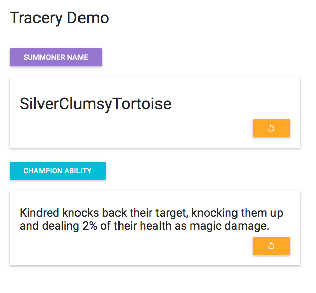

# Tracery Demo

This is a demo of Kate Compton's [Tracery](https://github.com/galaxykate/tracery), a Javascript text-expansion library.

Run:

```
$ python -m SimpleHTTPServer 8081
```

Visit http://localhost:8081/ to see the demo.



See also a [Cheap Bots Done Quick bot](http://cheapbotsdonequick.com/source/codepoetrybot) powered by `cheapbot.json` at [@codepoetrybot](https://twitter.com/codepoetrybot)